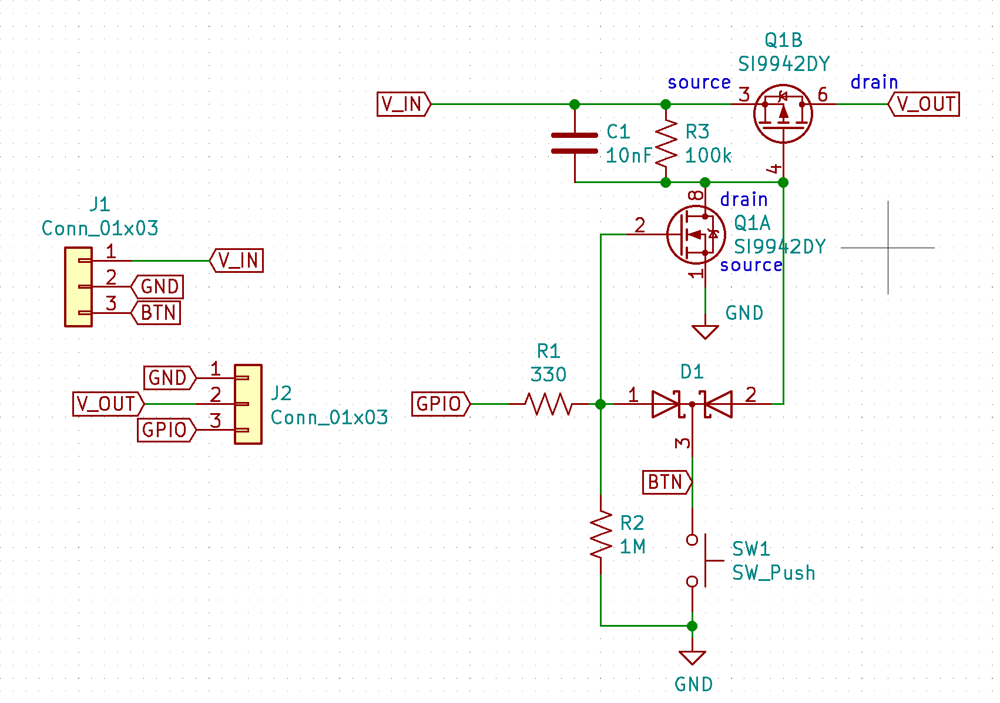
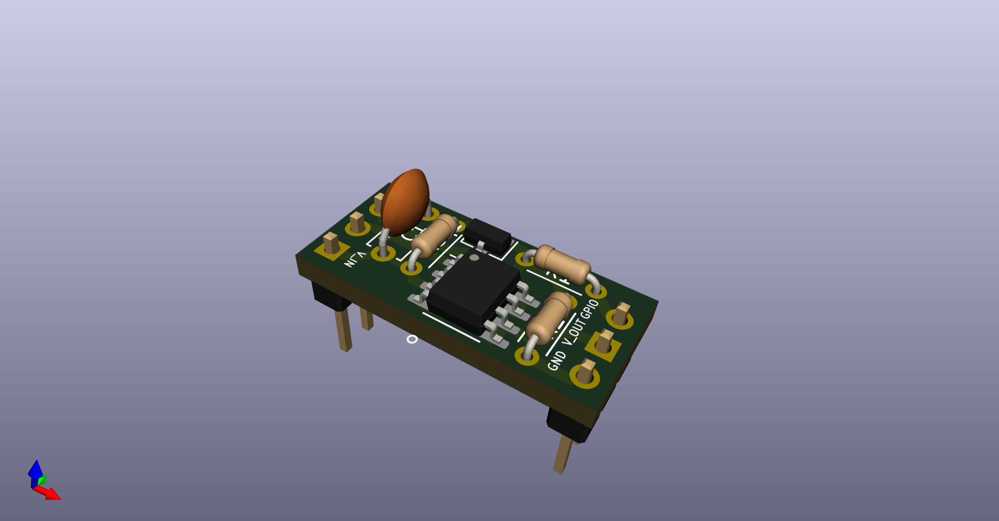
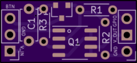
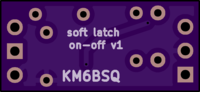

# Software latch on-off switch

source https://www.eevblog.com/forum/beginners/push-button-power-circuit-for-arduino-trying-to-modify-it-for-12v-input/

 

The button turns on the P-MOSFET when pushed, and also pulls the Arduino GPIO low so button pushes can be detected. The diodes keep the GPIO level and PMOS gate level separate.   

To keep the power on after the user releases the button, enable the GPIO's weak pullup, which keeps the N-MOSFET gate high, which keeps the P-MOSFET on.  N.B. The N-MOSFET gate pulldown *MUST* be large compared to the Arduino internal weak pullup, which is max. 50K.

To turn the power off, the Arduino sets the GPIO to Output Low.  Power off will be delayed if the user is holding the button down.  Holding the button down wont force poweroff if the Arduino is crashed.

# Fabrication

See kicad files.

## BOM
| Id | Designator | Package | Designation | Value | 
| ------------- | ------------- | ------------- | ------------- |------------- |
| 1 | D1 | SOT-23 | D_Schottky_x2_KCom_AAK | |
| 2 | R3 | R_Axial_DIN0204_L3.6mm_D1.6mm_P5.08mm_Horizontal |  | 100k | 
| 3 | R2 | R_Axial_DIN0204_L3.6mm_D1.6mm_P5.08mm_Horizontal |  | 1M | 
| 4 | R1 | R_Axial_DIN0204_L3.6mm_D1.6mm_P5.08mm_Horizontal |  | 330 | 
| 5 | Q1 | SOIC-8_3.9x4.9mm_P1.27mm | SI9942DY |  | 
| 6 | C1 | C_Disc_D4.7mm_W2.5mm_P5.00mm |  | 10nF | 
| 7 | J2,J1 | PinHeader_1x03_P2.54mm_Vertical | Conn_01x03 |  | 

## PCB

 
 
 

<a href="https://oshpark.com/shared_projects/e5mTrhY4"></img></a>
